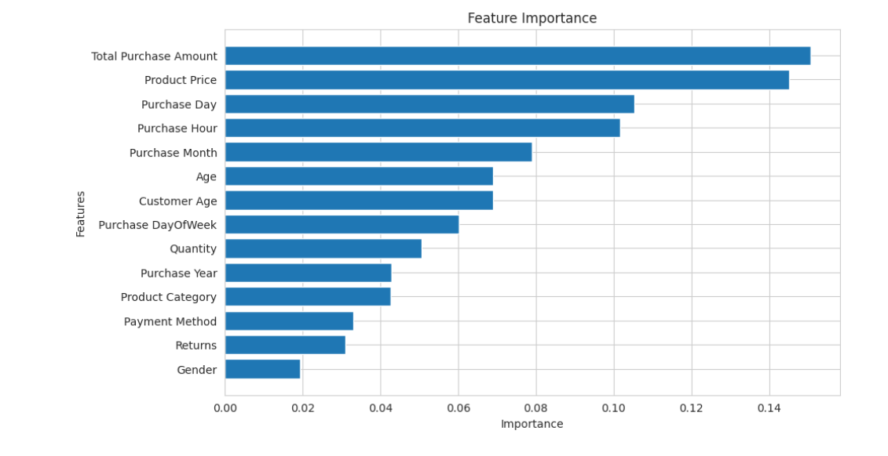
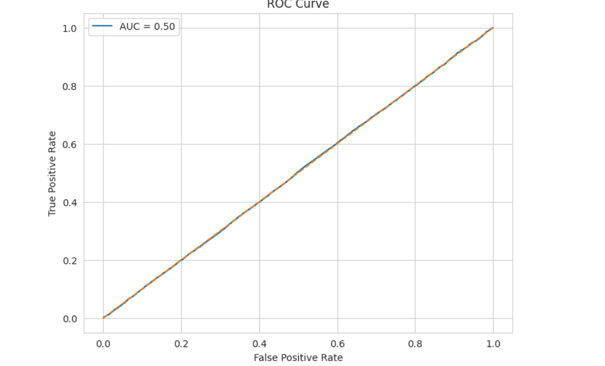
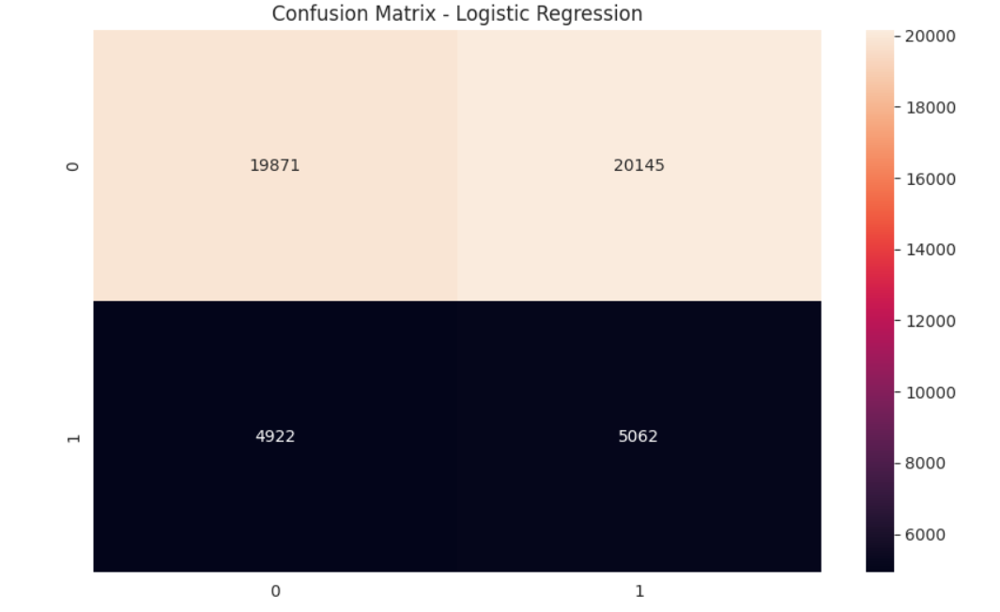

# E-commerce Customer Churn Prediction

Machine Learning project for predicting customer churn using customer purchase behavior data.

---

## Models Used
- Logistic Regression
- Random Forest

---

## Libraries
- Pandas
- NumPy
- Matplotlib
- Seaborn
- Scikit-learn

---

## Model Performance

| Model | Accuracy | Recall (Churn) |
|-------|----------|----------------|
| Logistic Regression | 49.88% | 51% |
| Random Forest | 80.03% | 0% |

---

## Feature Importance

---

## ROC Curve

---

## Confusion Matrix

